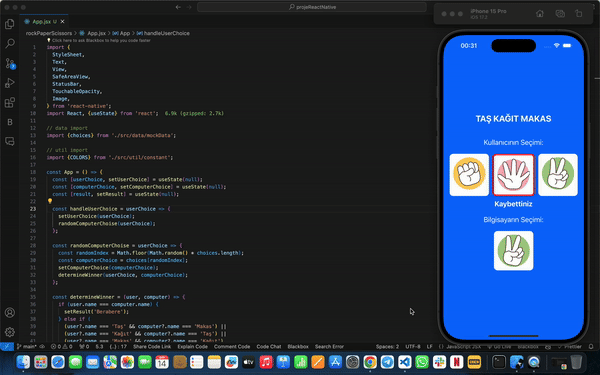

# Rock-Paper-Scissors

I've developed a classic Rock-Paper-Scissors game that you can play against the computer using React Native! 📱💻

With this simple yet entertaining game, users can compete against the computer by choosing rock, paper, or scissors. Depending on the users' selections, the screen displays whether they've won, lost, or tied in real-time. I aimed to provide both fun and competitive gameplay.

Developing this project with React Native's flexibility and performance was a delightful experience. Bringing together technology and entertainment to ensure users have a good time was important to me.

# ScreenShot

